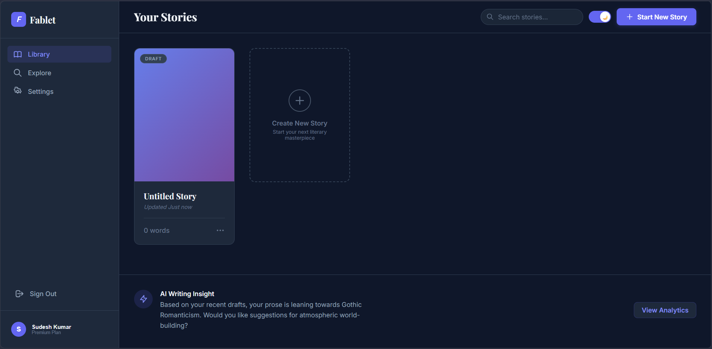
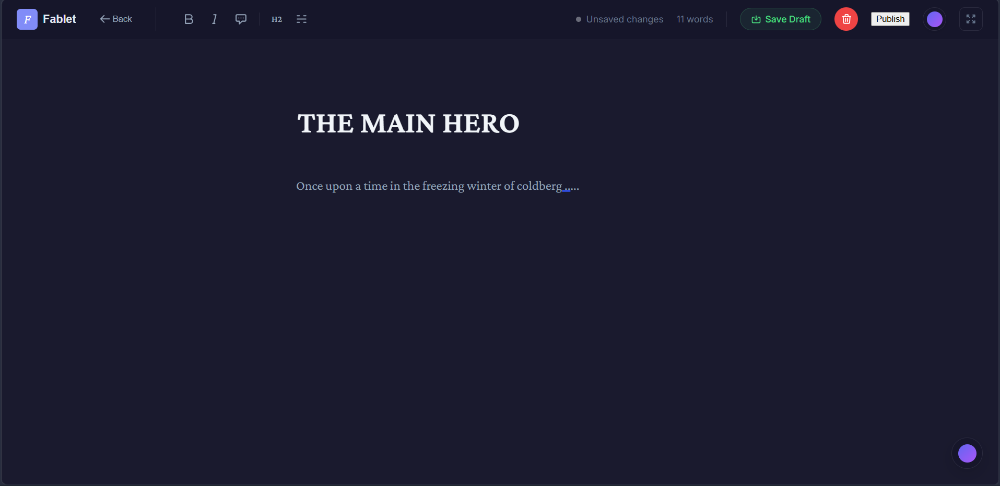
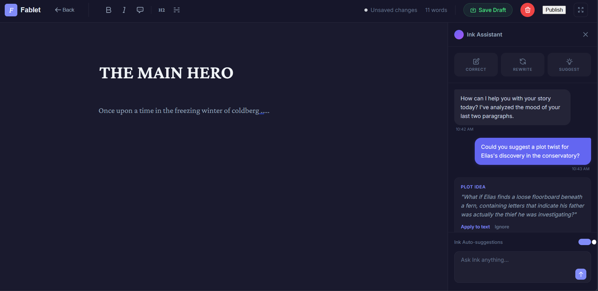
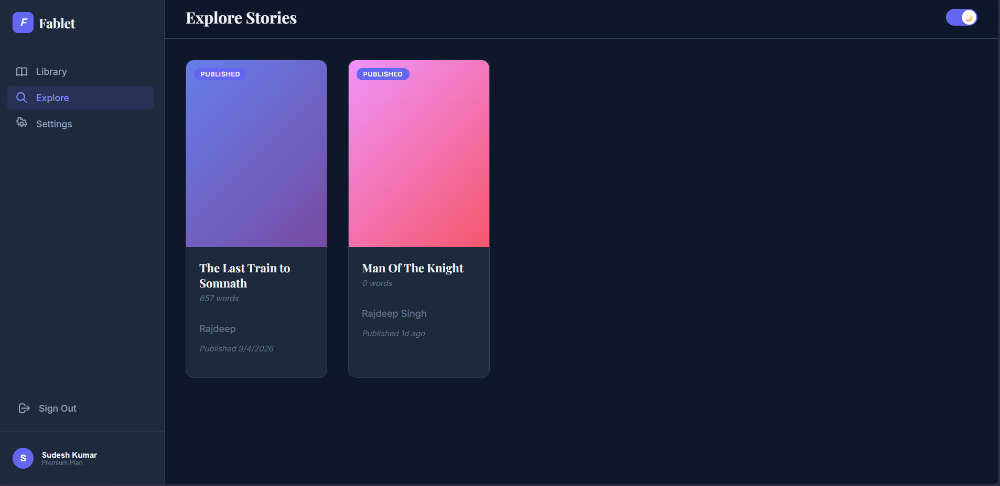

<div align="center">

# Fablet

**A modern, AI-powered writing platform for authors.**

<br/>

[](https://fablet.vercel.app)
[](https://fablet.onrender.com/health)
[](https://github.com/itsrajdeep/Fablet/stargazers)
[](https://github.com/itsrajdeep/Fablet/network)
[](LICENSE)

<br/>

> Fablet is a distraction-free, web-based writing application that helps authors create, edit, and publish their stories — powered by an integrated AI writing assistant named **Ink**.

<br/>

[🌐 Live Demo](https://fablet.vercel.app) &nbsp;&nbsp;•&nbsp;&nbsp; [⚙️ API Health](https://fablet.onrender.com/health) &nbsp;&nbsp;•&nbsp;&nbsp; [Report Bug](https://github.com/itsrajdeep/Fablet/issues) &nbsp;&nbsp;•&nbsp;&nbsp; [Request Feature](https://github.com/itsrajdeep/Fablet/issues)

</div>

---

## Screenshots

<table>
  <tr>
    <td align="center"><b>📚 Dashboard</b></td>
    <td align="center"><b>✍️ Editor</b></td>
  </tr>
  <tr>
    <td></td>
    <td></td>
  </tr>
  <tr>
    <td align="center"><b>🤖 Ink AI Assistant</b></td>
    <td align="center"><b>🌍 Explore Stories</b></td>
  </tr>
  <tr>
    <td></td>
    <td></td>
  </tr>
</table>

---

## Features

| Feature | Description |
|---|---|
| **Authentication** | Secure registration, login & logout with JWT-based sessions and bcrypt password hashing |
| **Smart Dashboard** | Centralized hub showing all drafts & published stories with word counts and quick actions |
| **Ink AI Assistant** | Integrated AI chat panel for plot suggestions, thematic ideas, and editing feedback |
| **Distraction-free Editor** | Real-time auto-saving, manual draft saving, and a clean full-focus writing canvas |
| **Persistent Theming** | Global Light / Dark mode that remembers your preference across all sessions |
| **Media Uploads** | Profile picture and cover image support via Cloudinary |
| **Story Exploration** | Browse and read published stories from other authors |
| **User Settings** | Full profile management including username, bio, and avatar |

---

## Tech Stack

### Frontend


### Backend


### Services


---

## Project Structure

```
Fablet/
├── client/                 # React frontend
│   └── src/
│       ├── pages/          # All page components (Editor, Dashboard, etc.)
│       ├── styles/         # Global and component CSS
│       ├── App.jsx         # Root component with routing
│       └── ThemeContext.jsx # Global theme (light/dark) provider
│
└── server/                 # Node.js + Express backend
    └── src/
        ├── routes/         # API route handlers (auth, stories, settings...)
        ├── mongoose/       # Mongoose models & schemas
        ├── middleware/     # JWT auth & validation middleware
        └── utils/          # Helper utilities
```

---

## Getting Started

### Prerequisites

- [Node.js](https://nodejs.org/) v18+
- [MongoDB Atlas](https://www.mongodb.com/atlas) account
- [Cloudinary](https://cloudinary.com/) account

### 1. Clone the repository

```bash
git clone https://github.com/itsrajdeep/Fablet.git
cd Fablet
```

### 2. Configure the backend

```bash
cd server
npm install
```

Create a `.env` file inside `server/`:

```env
PORT=5000
MONGO_URI=your_mongodb_atlas_connection_string
JWT_SECRET=your_jwt_secret_key
CLOUDINARY_CLOUD_NAME=your_cloudinary_cloud_name
CLOUDINARY_API_KEY=your_cloudinary_api_key
CLOUDINARY_API_SECRET=your_cloudinary_api_secret
```

Start the server:

```bash
npm run dev
```

### 3. Configure the frontend

```bash
cd ../client
npm install
npm start
```

The app will open at `http://localhost:3000`. The React dev server proxies API calls to `http://localhost:5000` automatically.

---

## Deployment

| Layer | Platform | Live URL |
|---|---|---|
| **Frontend** | [Vercel](https://vercel.com) | [fablet.vercel.app](https://fablet.vercel.app) |
| **Backend** | [Render](https://render.com) | [fablet.onrender.com](https://fablet.onrender.com) |
| **Database** | [MongoDB Atlas](https://www.mongodb.com/atlas) | Free M0 cluster |
| **Media** | [Cloudinary](https://cloudinary.com) | Free tier for uploads |

---

## Contributing

Contributions are welcome! Here's how:

1. Fork the repository
2. Create your feature branch: `git checkout -b feature/amazing-feature`
3. Commit your changes: `git commit -m 'Add some amazing feature'`
4. Push to the branch: `git push origin feature/amazing-feature`
5. Open a Pull Request

---

## License

This project is licensed under the **MIT License** — see the [LICENSE](LICENSE) file for details.

---

<div align="center">

Made with love by [itsrajdeep](https://github.com/itsrajdeep)

Star this repo if you find it useful!

</div>
